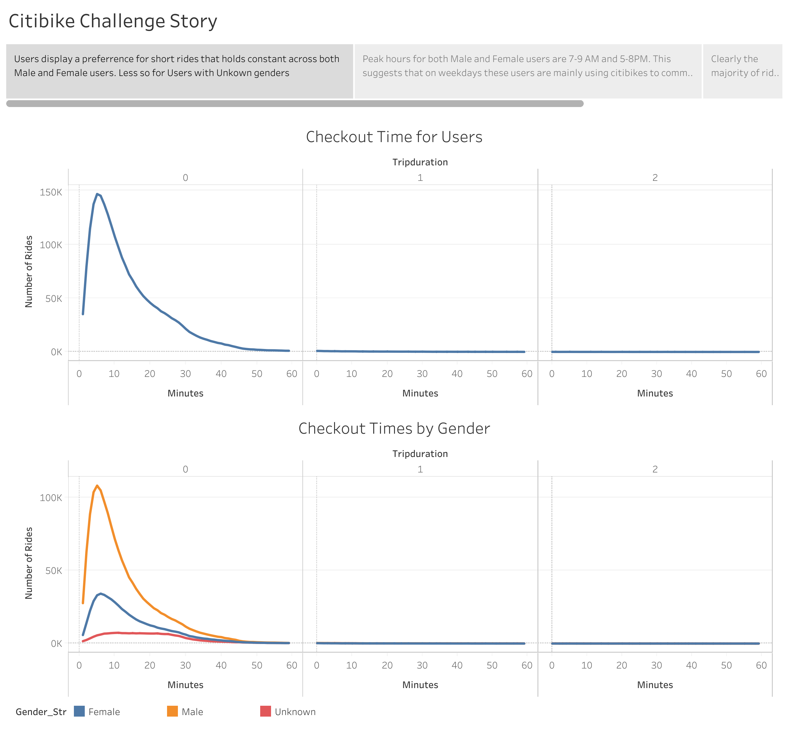
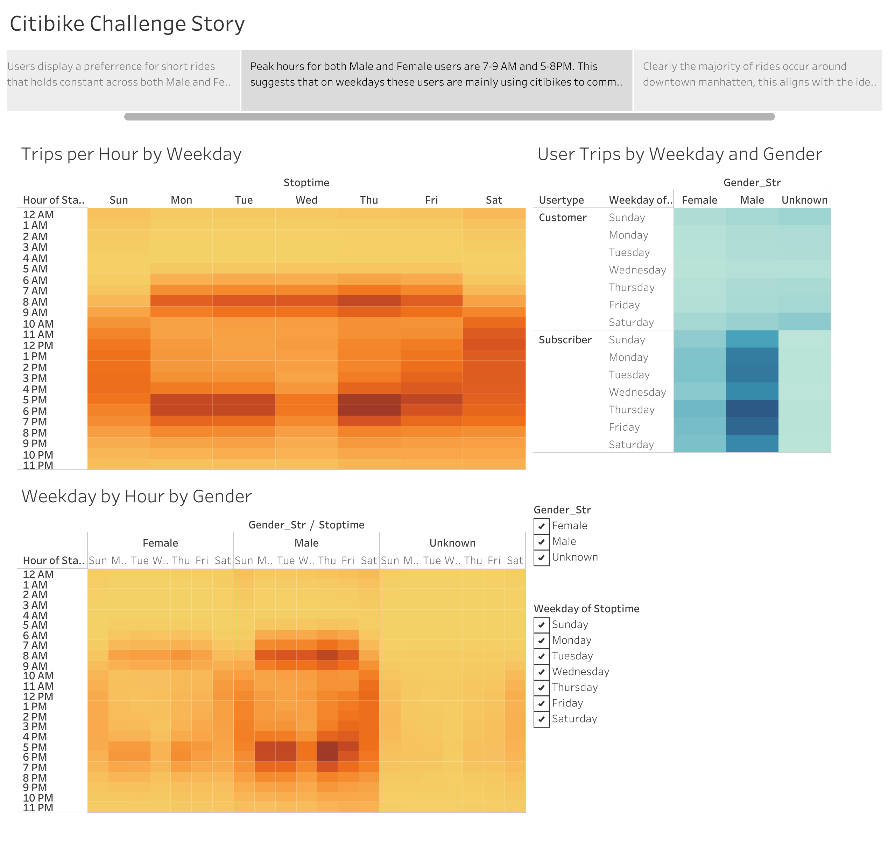
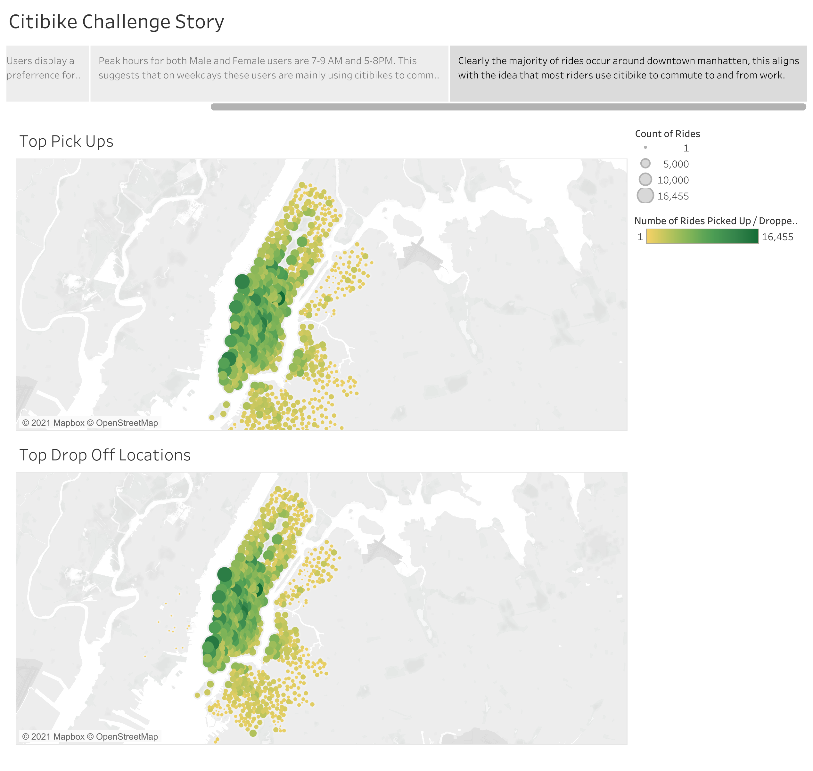

# Citibike Analysis

## Overview
The purpose of this analysis is to determine how the market for bike sharing operates in New York City. The data used was taken from Citibike's open data portal and the aim of the analysis is to see if a similar bikesharing platform could be opened in Des Moine.

## Results
Click [here](https://public.tableau.com/app/profile/matthew.hudson6424/viz/Citibike_Challenge_16227313435160/CitibikeChallengeStory) to explore the tableau public workbook.

  
* The above charts depict the distributions of the number of rides by the length of the ride. The distributions are clearly right-skewed, meaning that Citibike users prefer short rides. This is true of both the entire userbase and all genders. We can also see that males customers make up the majority of citibike's userbase.  

  
* These visualizations show the number of rides on each weekday, by the hour of the ride start, and by the gender of the customer. There are two major patterns that are clearly visible:
1. On workdays, male and femlae users tend to use bikes much more at 9AM and 5PM. From this we can assume that male and female customers mainly use citibikes in order to commute to and from work on workdays.
2. On weekends, all customers tend to spread their utilization over the course of the whole day.

* These two maps show the number of rides by where the user picked up the bike and dropped off the bike, respectively. We can see a clear difference in the number of rides between Manhatten and off-island boroughs and then again between north Manhatten and south Manhatten. Most of the rides taken appear to be in the downtown core of New York.
  
## Summary
These data seem to suggest that the core demographic for bikesharing is professionals who use the bikes in order to commute to work. In addition, these users must live close to their places of work in order to be able to commute by bike. This means that downtown cores are a key area for bikesharing since they tend to have more professionals living in them who are also live close to work.  
To enhance the analysis here we would suggest two further visualizations which may require enhancing the citibike data:
1. By adding an attribute to each data point of the overall weather at the time of the ride pickup, we could visualize the relationship between number of rides and weather patterns. This would help to determine the most profitable time of year to begin and end the bikeshare.
2. By collecting data on the number of accidents by pickup locations we could create a visualization of the most accident-prone areas of the city. This could help us understand which areas may be more risky for bikers and thus lead to lower costs by disincentivizing bikesharing in these areas.
